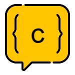
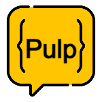

  

<h2 align="left" style="color:#FFC500;">About This Repository</h2>
A handpicked collection of the best tools, tutorials, and libraries for Playdate game development. Aimed at simplifying and enhancing the development process for creators at all levels.

<h2 align="left" style="color:#FFC500;">Table of Contents</h2>

- [Getting Started](#getting-started)
- [Tutorials](#tutorials)
- [Libraries](#libraries)
- [Tools and Utilities](#tools-and-utilities)
- [Sample Projects](#sample-projects)
- [Community Events](#community-events)
- [Updates and News](#updates-and-news)
- [Contributing](#contributing)
- [Contact](#contact)

## Getting Started
- <h2 style="color:#FFC500;">Documentation</h2>

  

  - **Title**: Inside Playdate
  - **Description**: The official reference documentation for programming Playdate games.
  - **Creator**: Panic Inc
  - **Link**: [Inside Playdate](https://sdk.play.date/2.1.1/Inside%20Playdate.html#_what_is_playdate)

  

  - **Title**: Inside Playdate
  - **Description**: The official reference documentation for programming Playdate games.
  - **Creator**: Panic Inc
  - **Link**: [Inside Playdate](https://sdk.play.date/2.1.1/Inside%20Playdate%20with%20C.html)

  

  - **Title**: PulpScript
  - **Description**: PulpScript is a friendly scripting language that allows you to add interactivity to your Pulp games. Its syntax is terse but powerful.
  - **Creator**: Panic Inc
  - **Link**: [PulpScript](https://play.date/pulp/docs/pulpscript/#goto-general)

- <h2 style="color:#FFC500;">Setting up your development environment</h2>

  **Title**: Getting Started with Playdate Game Development in 2023
  
  **Platform**: Windows
  - **Description**: In this video, I'll be going over what making games is like for the Playdate and how to setup a Playdate SDK game development environment on Windows using Visual Studio Code. This video is an update to a previous video I've made called "Getting Started with the Playdate SDK: Setup and Basics".
  - **Creator**: [SquidGod](https://squidgod.dev/)
  - **Link**: [First Game Tutorial](https://www.youtube.com/watch?v=ZPcfC98JogQ&t=289s)

- <h2 style="color:#FFC500;">Basics of Playdate SDK</h2>

  - **Creator**:
  - **Description**: A tutorial for creating your first simple game on Playdate.
  - **Link**: [First Game Tutorial](link-here)

## Tutorials
  

 

  - **Title**: PulpScript: A Beginner's Guide
  - **Description**: Are you learning to use Pulp for the Playdate but are struggling to wrap your head around PulpScript? I go through the basics of PulpScript in this beginner's guide tutorial, from how PulpScript interacts with the rest of Pulp to programming basics.
  - **Creator**: [SquidGod](https://squidgod.dev/)
  - **Link**: [YouTube](https://www.youtube.com/watch?v=r5GnCjsAqeQ)

  

 

  - **Title**: PulpScript: A Beginner's Guide
  - **Description**: Are you learning to use Pulp for the Playdate but are struggling to wrap your head around PulpScript? I go through the basics of PulpScript in this beginner's guide tutorial, from how PulpScript interacts with the rest of Pulp to programming basics.
  - **Creator**: [SquidGod](https://squidgod.dev/)
  - **Link**: [YouTube](https://www.youtube.com/watch?v=r5GnCjsAqeQ)

  

 

  - **Title**: PulpScript: A Beginner's Guide
  - **Description**: Are you learning to use Pulp for the Playdate but are struggling to wrap your head around PulpScript? I go through the basics of PulpScript in this beginner's guide tutorial, from how PulpScript interacts with the rest of Pulp to programming basics.
  - **Creator**: [SquidGod](https://squidgod.dev/)
  - **Link**: [YouTube](https://www.youtube.com/watch?v=r5GnCjsAqeQ)

## Libraries
### Graphics Libraries
- <h2 class=playdate-yellow>Title</h2>

  - 
  - **Description**: A tutorial for creating your first simple game on Playdate.
  - **Link**: [First Game Tutorial](link-here)

### Audio Libraries
- <h2 class=playdate-yellow>Title</h2>

  - 
  - **Description**: A tutorial for creating your first simple game on Playdate.
  - **Link**: [First Game Tutorial](link-here)

### Utility Libraries
- <h2 class=playdate-yellow>Title</h2>

  - 
  - **Description**: A tutorial for creating your first simple game on Playdate.
  - **Link**: [First Game Tutorial](link-here)

## Tools and Utilities
### Sprite Editors
- <h2 class=playdate-yellow>Title</h2>

  - 
  - **Description**: A tutorial for creating your first simple game on Playdate.
  - **Link**: [First Game Tutorial](link-here)

### Audio Tools
- <h2 class=playdate-yellow>Title</h2>

  - 
  - **Description**: A tutorial for creating your first simple game on Playdate.
  - **Link**: [First Game Tutorial](link-here)

### Debugging Tools
- <h2 class=playdate-yellow>Title</h2>

  - 
  - **Description**: A tutorial for creating your first simple game on Playdate.
  - **Link**: [First Game Tutorial](link-here)

## Sample Projects
### Simple Games
- <h2 class=playdate-yellow>Title</h2>

  - 
  - **Description**: A tutorial for creating your first simple game on Playdate.
  - **Link**: [First Game Tutorial](link-here)

## Updates and News
- <h2 class=playdate-yellow>Title</h2>

  - 
  - **Description**: A tutorial for creating your first simple game on Playdate.
  - **Link**: [First Game Tutorial](link-here)

## Community Events
- <h2 class=playdate-yellow>Title</h2>

  - 
  - **Description**: A tutorial for creating your first simple game on Playdate.
  - **Link**: [First Game Tutorial](link-here)

For more details and events, [click here](link-to-more-information).

<h2 align="left" class= playdate-yellow>🆘 Contributing</h1>

I welcome contributions! Please read [CONTRIBUTING.md](CONTRIBUTING.md) for details on our code of conduct and the process for submitting pull requests.

<h2 align="left" class= playdate-yellow>✉️ Contact</h1>

  

[Keith Baker](https://github.com/kjbaker-uk)

---

<h4 align="center" class="playdate-yellow"><em>This repository is a community-driven project and is not officially affiliated with Panic Inc. or the Playdate development team.</em></h4>

  
© Panic Playdate is a registered trademark of Panic Inc
