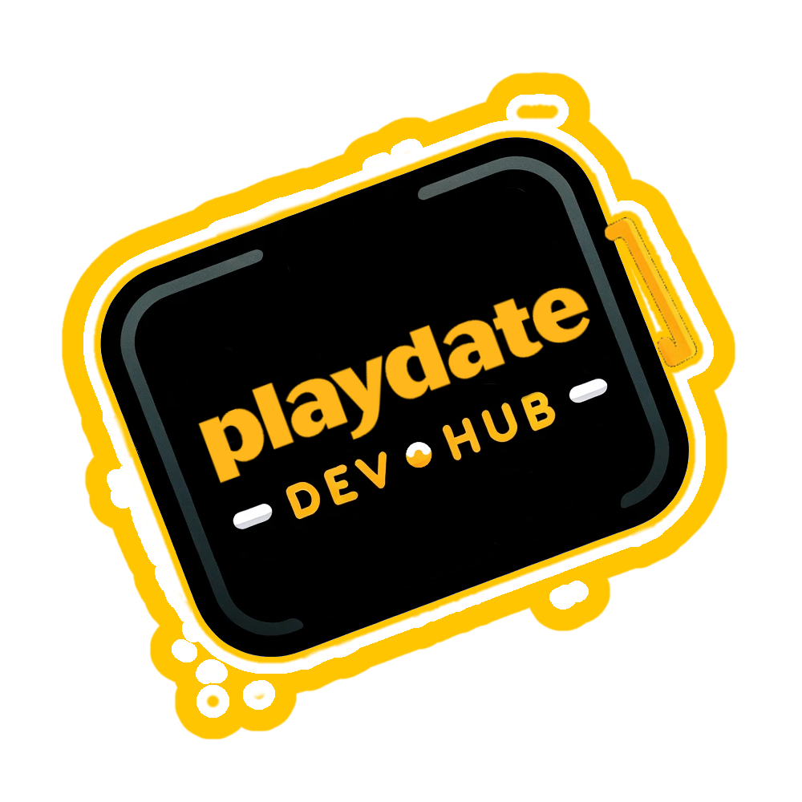

  

<h2 align="left" style="color:#FFC500;">About The Dev Hub</h2>
A handpicked collection of the best tools, tutorials, and libraries for Playdate game development. Aimed at simplifying and enhancing the development process for creators at all levels.

<h4 align="center" class="playdate-yellow"><em>This repository is a community-driven project and is NOT officially affiliated with Panic Inc. or the Playdate development team.</em></h4>

  
Playdate is a registered trademark of Panic Inc

<h2 align="left" style="color:#FFC500;">Table of Contents</h2>

- [Getting Started](#getting-started)
- [Tutorials](#tutorials)
- [Libraries](#libraries)
- [Tools and Utilities](#tools-and-utilities)
- [Sample Projects](#sample-projects)
- [Asset Vault](#asset-vault)
- [Community Events](#community-events)
- [Updates and News](#updates-and-news)
- [Contributing](#contributing)
- [Contact](#contact)

## Getting Started
- <h2 style="color:#FFC500;">Offical Documentation</h2>

  **Title**: Designing for Playdate
  - **Description**: This document offers advice on how to make your game more accessible and pleasant to play. Much of this is subjective, informed by our own experience developing for Playdate. We don’t enforce these guidelines. But be aware that not considering the guidelines may limit the potential audience for your game.
  - **Creator**: Panic Inc
  - **Url**: [Designing for Playdate](https://sdk.play.date/2.1.1/Designing%20for%20Playdate.html)

  

  **Title**: Inside Playdate
  - **Description**: The official reference documentation for programming Playdate games.
  - **Creator**: Panic Inc
  - **Url**: [Inside Playdate](https://sdk.play.date/2.1.1/Inside%20Playdate.html#_what_is_playdate)

  

  **Title**: Inside Playdate
  - **Description**: The official reference documentation for programming Playdate games.
  - **Creator**: Panic Inc
  - **Link**: [Inside Playdate](https://sdk.play.date/2.1.1/Inside%20Playdate%20with%20C.html)

  

  **Title**: PulpScript
  - **Description**: PulpScript is a friendly scripting language that allows you to add interactivity to your Pulp games. Its syntax is terse but powerful.
  - **Creator**: Panic Inc
  - **Url**: [PulpScript](https://play.date/pulp/docs/pulpscript/#goto-general)

- <h2 style="color:#FFC500;">Setting up your development environment</h2>

  **Title**: Getting Started with Playdate Game Development in 2023
  
  **Platform**: Windows
  - **Description**: In this video, I'll be going over what making games is like for the Playdate and how to setup a Playdate SDK game development environment on Windows using Visual Studio Code. This video is an update to a previous video I've made called "Getting Started with the Playdate SDK: Setup and Basics".
  - **Creator**: [SquidGod](https://squidgod.dev/)
  - **YouTube**: [First Game Tutorial](https://www.youtube.com/watch?v=ZPcfC98JogQ&t=289s)

  ---
  **Title**: How to get started with the Playdate SDK for Mac OS
  
  **Platform**: Mac OS
  - **Description**: Setting up the playdate sdk on mac os and running example projects.
  - **Creator**: [eeee](https://www.youtube.com/@donnyeeee)
  - **YouTube**: [First Game Tutorial](https://www.youtube.com/watch?v=IgBgnpJeuDs)

## Tutorials
  

 

  **Title**: Learn to Code in Lua for Playdate Game Dev! Part 1
  - **Description**: Want to learn how to make games for the Playdate, but don't know how to program? No worries - in this video I'll go over basic programming concepts for complete beginners like variables, operators, and functions. I'll be teaching Lua, one of the languages you can use with the Playdate SDK. This is for people who want to use the Playdate SDK, and is not a guide for Pulp. If you want to learn Pulp, I have some videos for that on my channel as well.
  - **Creator**: [SquidGod](https://squidgod.dev/)
  - **YouTube**: [YouTube](https://www.youtube.com/watch?v=C4o7n0LNQhA)

 ---

  **Title**: Learn to Code in Lua for Playdate Game Dev! Part 2
  - **Description**: Want to learn how to make games for the Playdate, but don't know how to program? No worries - this is part 2 of my series going over basic programming concepts for complete beginners like tables (array + dictionary), loops, and using the Playdate SDK libraries. I'll be teaching Lua, one of the languages you can use with the Playdate SDK. This is for people who want to use the Playdate SDK, and is not a guide for Pulp. If you want to learn Pulp, I have some videos for that on my channel as well.
  - **Creator**: [SquidGod](https://squidgod.dev/)
  - **YouTube**: [YouTube](https://www.youtube.com/watch?v=x_Wi2EjjKz8&t=9s)

   ---

  **Title**: How to Make a Metroidvania/Platformer | Playdate SDK Tutorial
  - **Description**: In this video, I go step by step in teaching you how to make a metrodivania/platformer game similar to my game "The King's Dungeon" for the Playdate SDK using Lua.
  - **Creator**: [SquidGod](https://squidgod.dev/)
  - **YouTube**: [YouTube](https://www.youtube.com/watch?v=7GbUxjE9rRM&t=609s)

  

 

  **Title**: PulpScript: A Beginner's Guide
  - **Description**: Are you learning to use Pulp for the Playdate but are struggling to wrap your head around PulpScript? I go through the basics of PulpScript in this beginner's guide tutorial, from how PulpScript interacts with the rest of Pulp to programming basics.
  - **Creator**: [SquidGod](https://squidgod.dev/)
  - **YouTube**: [YouTube](https://www.youtube.com/watch?v=r5GnCjsAqeQ)

  

 

  **Title**: PulpScript: A Beginner's Guide
  - **Description**: Are you learning to use Pulp for the Playdate but are struggling to wrap your head around PulpScript? I go through the basics of PulpScript in this beginner's guide tutorial, from how PulpScript interacts with the rest of Pulp to programming basics.
  - **Creator**: [SquidGod](https://squidgod.dev/)
  - **YouTube**: [YouTube](https://www.youtube.com/watch?v=r5GnCjsAqeQ)

 ---

  **Title**: How to make a video game NO experience for FREE | Playdate pulp tutorial | Playdate console games
  - **Description**: Playdate pulp tutorial Playdate pulp for the Playdate console is the best free game making tool and free game making software in 2022!
  - **Creator**: [Playdate Central](https://www.youtube.com/c/PlaydateCentral)
  - **YouTube**: [YouTube](https://www.youtube.com/watch?v=Swi7MmQNdrY)

 ---

  **Title**: Make an Adventure Game for the Playdate using Pulp
  - **Description**: In this tutorial I teach you how to make a simple Adventure game for the Playdate with health, hazards, locked doors, and more using Pulp.
  - **Creator**: [SquidGod](https://squidgod.dev/)
  - **YouTube**: [YouTube](https://www.youtube.com/watch?v=p4eLcP3hgJc)

## Libraries
### Graphics Libraries
- <h2 class=playdate-yellow>Title</h2>

  - 
  - **Description**: A tutorial for creating your first simple game on Playdate.
  - **YouTube**: [First Game Tutorial](link-here)

### Audio Libraries
- <h2 class=playdate-yellow>Title</h2>

  - 
  - **Description**: A tutorial for creating your first simple game on Playdate.
  - **YouTube**: [First Game Tutorial](link-here)

### Utility Libraries
- <h2 class=playdate-yellow>Title</h2>

  - 
  - **Description**: A tutorial for creating your first simple game on Playdate.
  - **YouTube**: [First Game Tutorial](link-here)

## Tools and Utilities
### Sprite Editors
- <h2 class=playdate-yellow>Title</h2>

  - 
  - **Description**: A tutorial for creating your first simple game on Playdate.
  - **YouTube**: [First Game Tutorial](link-here)

### Audio Tools
- <h2 class=playdate-yellow>Title</h2>

  - 
  - **Description**: A tutorial for creating your first simple game on Playdate.
  - **YouTube**: [First Game Tutorial](link-here)

### Debugging Tools
- <h2 class=playdate-yellow>Title</h2>

  - 
  - **Description**: A tutorial for creating your first simple game on Playdate.
  - **YouTube**: [First Game Tutorial](link-here)

## Sample Projects
### Simple Games
- <h2 class=playdate-yellow>Title</h2>

  - 
  - **Description**: A tutorial for creating your first simple game on Playdate.
  - **YouTube**: [First Game Tutorial](link-here)

## Asset Vault
I have started an asset vault to hold all of my surplus assets that may be of use to someone else.
Please feel free to add to these and change the folder structure if you feel it could be layed out better.
I have included items such as;

 - Music
 - SFX
 - Sprites
 - UI - Buttons / Icons etc

## Updates and News
- <h2 class=playdate-yellow>Title</h2>

  - 
  - **Description**: A tutorial for creating your first simple game on Playdate.
  - **YouTube**: [First Game Tutorial](link-here)

## Community Events
- <h2 class=playdate-yellow>Title</h2>

  - 
  - **Description**: A tutorial for creating your first simple game on Playdate.
  - **YouTube**: [First Game Tutorial](link-here)

For more details and events, [click here](link-to-more-information).

<h2 align="left" class= playdate-yellow>🆘 Contributing</h1>

I welcome contributions! Please read [CONTRIBUTING.md](CONTRIBUTING.md) for details on our code of conduct and the process for submitting pull requests.

<h2 align="left" class= playdate-yellow>✉️ Contact</h1>

  

[Keith Baker](https://github.com/kjbaker-uk)